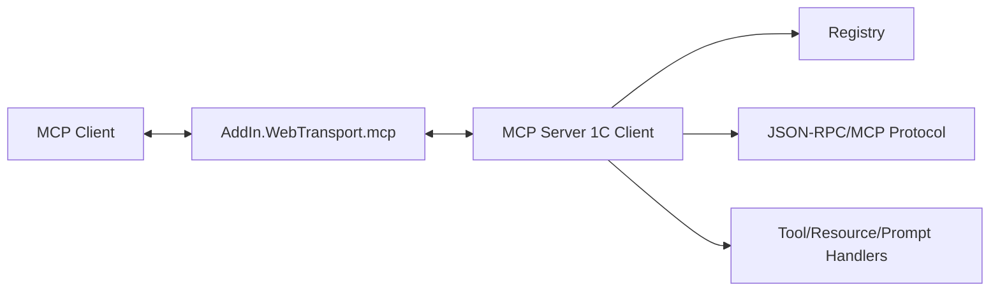
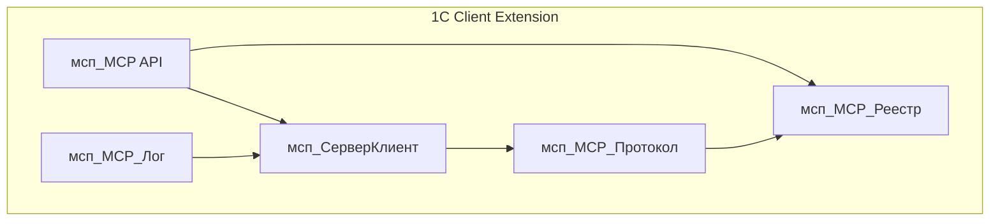
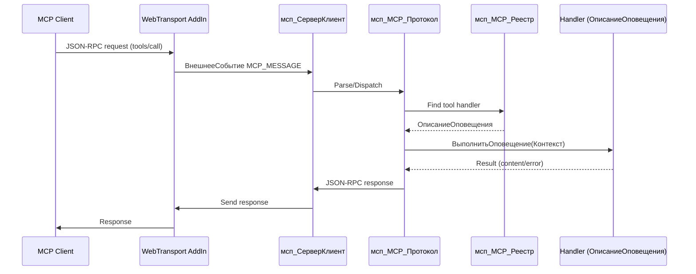
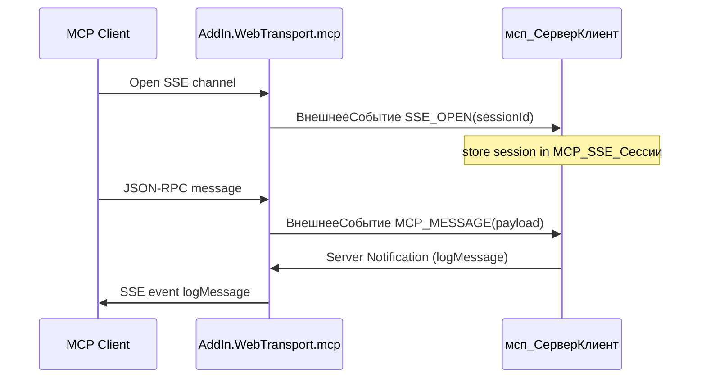

# MCP Server Architecture (MVP)

## HLD (Context)

```mermaid
flowchart LR
  Client[MCP Client] <--> Transport[AddIn.WebTransport.mcp]
  Transport <--> Server[MCP Server 1C Client]
  Server --> Registry[Registry]
  Server --> Protocol[JSON-RPC/MCP Protocol]
  Server --> Handlers[Tool/Resource/Prompt Handlers]
```

## Component Layers (MVP)

```mermaid
flowchart TB
  subgraph ClientSide[1C Client Extension]
    API[мсп_MCP API]
    Registry[мсп_MCP_Реестр]
    Protocol[мсп_MCP_Протокол]
    Transport[мсп_СерверКлиент]
    Log[мсп_MCP_Лог]
  end

  API --> Registry
  API --> Transport
  Protocol --> Registry
  Transport --> Protocol
  Log --> Transport
```

## Sequence (tools/call)

```mermaid
sequenceDiagram
  participant C as MCP Client
  participant T as WebTransport AddIn
  participant S as мсп_СерверКлиент
  participant P as мсп_MCP_Протокол
  participant R as мсп_MCP_Реестр
  participant H as Handler (ОписаниеОповещения)

  C->>T: JSON-RPC request (tools/call)
  T->>S: ВнешнееСобытие MCP_MESSAGE
  S->>P: Parse/Dispatch
  P->>R: Find tool handler
  R-->>P: ОписаниеОповещения
  P->>H: ВыполнитьОповещение(Контекст)
  H-->>P: Result (content/error)
  P->>S: JSON-RPC response
  S->>T: Send response
  T->>C: Response
```

## Transport (SSE + WebTransport.mcp)

```mermaid
sequenceDiagram
  participant C as MCP Client
  participant T as AddIn.WebTransport.mcp
  participant S as мсп_СерверКлиент

  C->>T: Open SSE channel
  T->>S: ВнешнееСобытие SSE_OPEN(sessionId)
  Note over S: store session in MCP_SSE_Сессии

  C->>T: JSON-RPC message
  T->>S: ВнешнееСобытие MCP_MESSAGE(payload)

  S->>T: Server Notification (logMessage)
  T->>C: SSE event logMessage
```
