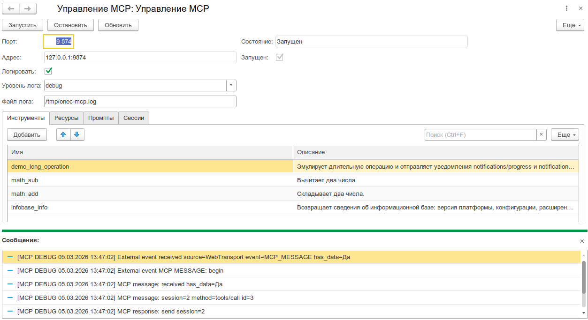
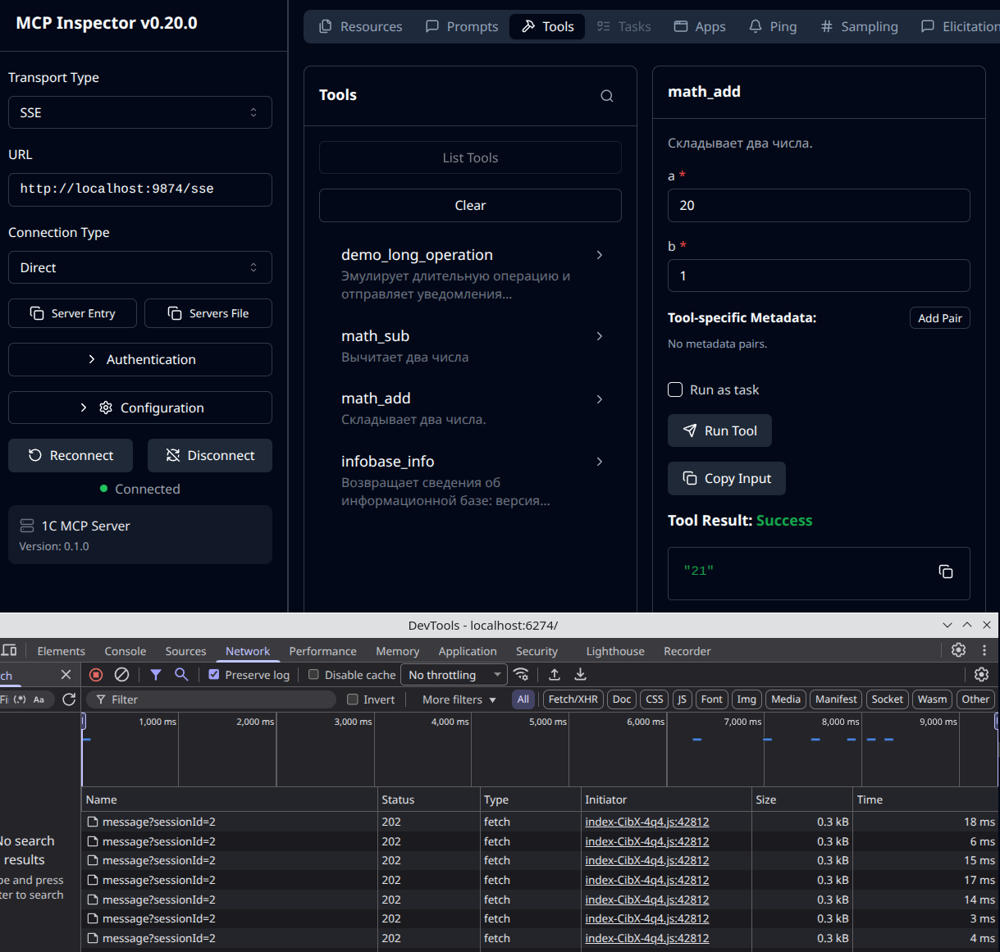

# 1C Client MCP Server

Реализация MCP сервера (Model Context Protocol), который запускается внутри клиента 1С:Предприятие. Проект ориентирован на работу через внешнюю компоненту `AddIn.WebTransport.mcp` и обрабатывает MCP запросы по JSON-RPC.

> [!CAUTION]
> Важно, проект еще не имеет стабильного релиза. Поэтому интерфейсы и внутренние API могут меняться.

## Возможности

- Запуск MCP сервера в клиентском контуре 1С:Предприятия.
- Поддержка инструментов, ресурсов и промптов MCP.
- Транспорт WebTransport MCP через внешнюю компоненту `AddIn.WebTransport.mcp`.
- Реестр обработчиков и унифицированное логирование событий.
- Форма управления MCP в составе расширения.

## Запуск из командной строки 1С

MCP-сервер можно запустить сразу при старте клиента 1С через параметр `/C`:

```text
/C"runMcp"
/C"runMcp=/tmp/mcp-conf.json"
/C"runMcp=/tmp/mcp-conf.json;mcpPort=123"
```

Если путь в `runMcp` заполнен, он читается как JSON-конфигурация. В JSON используются ключи `port` и `timeout`, а в строке `/C` - `mcpPort`; значение порта из `/C` имеет приоритет. Если порт не указан, используется `8080`, если таймаут не указан - `900`.

Минимальный JSON-конфиг:

```json
{
  "port": 8080,
  "timeout": 900
}
```

## Скриншоты




## Пример инструмента

Пример регистрации и обработки инструмента сложения из `exts/client-mcp/src/CommonModules/Мсп_ИнструментСложениеКлиент/Module.bsl`.

```bsl
Процедура ЗарегистрироватьИнструменты() Экспорт
	Мсп_РеестрКлиент.ЗарегистрироватьИнструмент(Мсп_ИнструментыКлиент.ОписаниеИнструмента(
		"math_add",
		"Складывает два числа.",
		СхемаВходныхПараметров(),
		Новый ОписаниеОповещения("ОбработатьИнструментСложение", Мсп_ИнструментСложениеКлиент)));
КонецПроцедуры

Функция ОбработатьИнструментСложение(Запрос, ДополнительныеПараметры) Экспорт
	Аргументы = Запрос.Аргументы;
	Возврат Аргументы.a + Аргументы.b;
КонецФункции
```

## Структура репозитория

- `exts/client-mcp` — исходники расширения 1С (EDT-формат).
- `tests` — тестовая конфигурация на базе YAxUnit.
- `ARCHITECTURE.md` — обзор архитектуры и взаимодействий компонентов.
- `docs/decisions` — архитектурные решения (ADR).
- `docs/solution-invariants.md` — инварианты решения, подтвержденные кодом и тестами.
- `docs/code-style.md` — правила оформления BSL кода.

## Архитектура

Схемы взаимодействия и детали слоев описаны в `ARCHITECTURE.md`.

## Доработки форка SteelMorgan относительно upstream `1c-neurofish/onec-client-mcp-devkit`

Форк построен поверх upstream `master` и добавляет 2 коммита, реализующих **транспорт‑агностичный режим работы MCP‑сервера**: расширение умеет работать как через локальный HTTP‑сервер (исходный режим), так и через WebSocket к внешнему оркестратору `v8-client-session-manager` (новый режим). Это даёт single‑point‑of‑integration для AI‑агентов — менеджер агрегирует tools со многих 1С‑клиентов и публикует общий MCP‑каталог.

### Bundle компоненты `AddIn.WebTransport` 0.7.0

`exts/client-mcp/src/CommonTemplates/Мсп_webTransport/Template.addin` обновлён с upstream `alkoleft/web-transport-addin@0.6.4` на собственный билд `SteelMorgan/web-transport-addin@7e76820` (0.7.0):

- Полная матрица ОС: Win x32+x64, Linux x32+x64, macOS x64 (versioned filenames).
- Новый класс `AddIn.WebTransport.session` (WS‑клиент к session‑manager).
- Прокидывание `host_id` + `pid` + `capabilities` в `session.register`.
- Системные методы `addin.spawn` / `addin.kill` для удалённого порождения дочерних 1С‑клиентов.
- Override `/C client_uid=...` для manager‑spawned клиентов.

### Новые общие модули

| Модуль | Назначение |
|--------|-----------|
| `Мсп_ТранспортСессионКлиент` | WS‑клиент к session‑manager через `AddIn.WebTransport.session`. Обрабатывает события `WS_RECONNECT_STATE` / `WS_INCOMING`, отправляет `session.register`, маршрутизирует входящие RPC: `tool.call` / `tool.cancel` / `session.shutdown` / `ping`. Хранит client state с полем `kind`. |
| `Мсп_СерверОтветы` | Транспорт‑агностичный фасад отправки JSON‑RPC ответов. Выбор канала: `ws` → `Мсп_ТранспортСессионКлиент`, `http` → `Мсп_ТранспортСобытияКлиент`. |

Оба зарегистрированы в `Configuration.mdo`.

### Расширение существующих модулей

#### `Мсп_ПараметрыЗапускаКлиент` (+133 строки)

Dual‑mode startup через `/C mcpMode=ws|http|auto`:
- `http` — исходное поведение (локальный HTTP‑сервер).
- `ws` — подключение к session‑manager.
- `auto` — попытка WS, fallback на HTTP при неудаче. При срабатывании fallback состояние сбрасывается через `Мсп_СостояниеКлиент.УстановитьЗначениеСостоянияСервера("РежимТранспорта", "http")`, чтобы фасад `Мсп_СерверОтветы` вернулся к HTTP‑маршруту. Логи перехода — через `Мсп_ЛогированиеКлиент`.
- **(нет ключа)** — backward compatibility: ветка `runMcp=` работает как в upstream без изменений (если `mcpMode` не задан и `runMcp=` отсутствует — расширение просто не стартует никакого транспорта).

Резолвинг `manager_url`: при отсутствии `/C manager_url=...` используется default `ws://127.0.0.1:4000/sessions` (доступен и из контейнера, и с Windows‑хоста через port‑forwarding VS Code).

Парсинг дополнительных `/C`‑параметров (через разделитель `;`): `manager_url`, `client_uid`, `kind`, `corr_id`, `mcp_ws_timeout_ms`. Эвристика `kind` по умолчанию: `1c-client`. Если `client_uid` не передан — генерируется свежий `Новый УникальныйИдентификатор`.

Точечная правка `ЗапуститьИзПараметраЗапуска`: добавлен dispatch по `mcpMode`, остальная сигнатура и backward‑compat поведение сохранены. Шесть новых служебных функций: `НормализоватьРежим`, `ManagerURLПоУмолчанию`, `ИзвлечьПараметрыWS`, `ЗапуститьWS`, `ЗапуститьHTTPПоПараметрам`, `ЗапуститьAuto`.

#### `ManagedApplicationModule` (dual‑language hooks)

Идемпотентные обёртки `&После` сразу для двух языковых веток БСП:

```bsl
&После("OnStart")                  // EN-БСП (Drive, ERP World)
&После("ПриНачалеРаботыСистемы")   // RU-БСП (УНФ, ERP, Бухгалтерия)
&После("ExternEventProcessing")
&После("ОбработкаВнешнегоСобытия")
```

Каждая пара EN/RU делегирует общему диспетчеру (`Мсп_ИнициироватьСтарт` / `Мсп_ДиспетчерВнешнегоСобытия`). Идемпотентность через флаг `Мсп_СтартИнициирован` — гарантирует ровно один запуск, если БСП‑конфигурация (нестандартно) имеет оба хука стартовых событий. Диспетчер внешних событий маршрутизирует `WebTransport.WS_RECONNECT_STATE` / `WS_INCOMING` в `Мсп_ТранспортСессионКлиент`, остальное — в существующий `Мсп_ТранспортСобытияКлиент`.

### Сценарий использования

1. Пользователь запускает 1С с параметром `/C "mcpMode=ws;manager_url=ws://host:4000/sessions"`.
2. После старта `Мсп_ТранспортСессионКлиент` подключается к менеджеру через `AddIn.WebTransport.session`.
3. Расширение шлёт `session.register` с локальным каталогом MCP tools/resources/prompts (включая VA‑шаги, если установлена Vanessa Automation).
4. AI‑агент получает агрегированный MCP‑каталог от менеджера и вызывает tools через JSON‑RPC поверх WS.
5. `Мсп_СерверОтветы` отправляет результаты обратно по тому же WS‑каналу.
